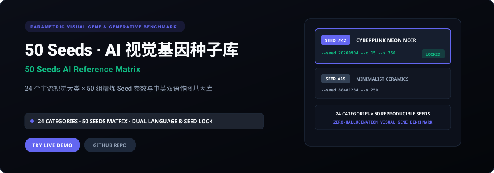

<p align="right">
  <strong>简体中文</strong> · <a href="./README.en.md">English</a>
</p>

<p align="center">
  
</p>

<p align="center">
  <a href="https://50-seeds.xiaosang.cc/"><strong>🌐 在线体验 (Live Demo)</strong></a> · 
  <a href="https://holynova.github.io/50-seeds/"><strong>🚀 备选镜像 (GitHub Pages)</strong></a> · 
  <a href="https://github.com/holynova/50-seeds"><strong>📦 GitHub 源码</strong></a> · 
  <a href="https://xiaosang.cc/"><strong>✨ 更多作品集</strong></a>
</p>

---

## 真实预览 (Proof of Work)

<p align="center">
  
</p>

---

## 项目简介 (What It Is)

为 AI 艺术创作者准备的参数化视觉参考库。收录 24 个主流设计与艺术大类（涵盖人物肖像、赛博都市、建筑空间、微距特写等），每个类别提供 50 组经过严苛验证的纯净视觉种子 (Seed) 与提示词对照，帮助创作者稳定控制画面随机性并实现风格锁定。

---

## 核心机制与特色 (Why It Matters)

- **风格锁定与随机性收敛**：记录各模型在固定 Seed 搭配下呈现的稳定美学特征，大幅减少抽卡试错成本。
- **24 大主流设计门类覆盖**：涵盖 3D 渲染、复古摄影、极简海报、概念插画、产品微距等多样化落地场景。
- **中英双语结构化对照**：一键复制中英提示词与核心 Seed 参数，完美适配主流文生图引擎。
- **极速卡片矩阵与主题切换**：支持日间/夜间高对比模式无缝切换，适配移动端轻量级响应式快速检索。

---

## 收录清单与规格 (Inventory & Scope)

24 个专业大类、50 组精准 Seed 组合、双语关键词、夜间/日间高对比主题、一键复制与本地离线浏览。

---

## 快速开始 (Quick Start)

### 1. 在线体验
无需安装任何环境，直接在浏览器中打开：
- 🌐 **主站演示 (Primary)**：[https://50-seeds.xiaosang.cc/](https://50-seeds.xiaosang.cc/)
- 🚀 **备选镜像 (GitHub Pages)**：[https://holynova.github.io/50-seeds/](https://holynova.github.io/50-seeds/)

### 2. 本地运行与调试
克隆仓库后执行以下命令：

```bash
git clone https://github.com/holynova/50-seeds.git
cd 50-seeds
open index.html # Pure static HTML5, open directly in browser
```

---

## 开源协议与作者 (License & Author)

- **作者**：[holynova (小桑)](https://xiaosang.cc/)
- **授权协议**：[MIT License](./LICENSE)
- **合辑收录**：本仓库作为精选项目收录于 [Where Craft Lives (xiaosang.cc)](https://xiaosang.cc/)。
